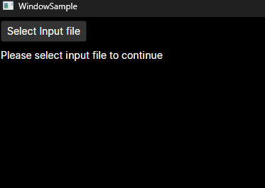
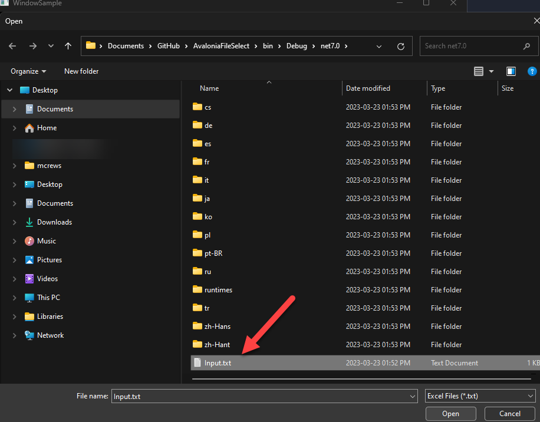
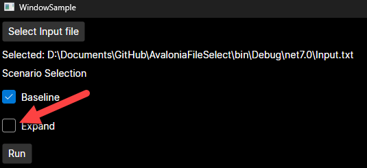
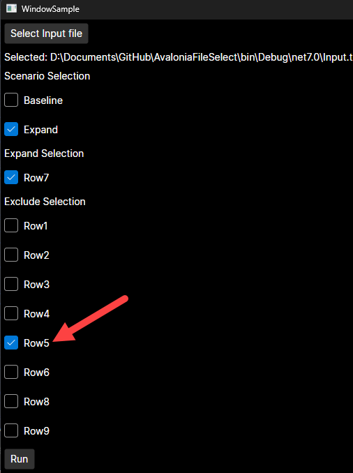

# AvaloniaUIBug

Example of bug in Avalonia render.

## Steps to Recreate Bug

1. Build and run the project. You should be presented with the following screen:

2. Click on the `Select Input File` button and select the `Input.txt` file that is copied to the output directory.

   

3. You will now be allowed to select between the `Baseline` option or the `Expand` option. Select `Expand`.

4. When you make this selection. You will be presented with a series of options. Select `Row7`. When you do this, you will see that the `Row5`  option in the `Exclude Selection` options is rendered as checked when it should not be.

   
